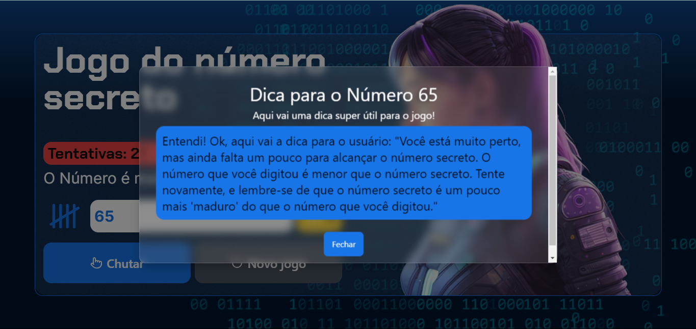

# Jogo do Número Secreto

## Funcionalidades

- **Geração de Números Aleatórios**: Utiliza a função `RandomNumberGenerator` para gerar números aleatórios exclusivos.
- **Modais Interativos**: Implementação de modais para fornecer dicas ao jogador, incluindo sugestões geradas por uma inteligência artificial.
- **Notificações**: Utiliza o `react-toastify` para exibir mensagens de dica, alertas e sucesso.
- **Áudio de Aplausos**: Áudio de aplausos reproduzido ao acertar o número secreto.
- **Cookies**: Armazena o número de dicas restantes e o tempo de cooldown utilizando `js-cookie`.

## Tecnologias Utilizadas

### Front-end (React)

- React
- `react-toastify`
- `lucide-react`
- `js-cookie`

### Back-end (TypeScript)

- TypeScript
- Express

## Badges

## Instalação

1. Clone o repositório: `git clone https://github.com/seu-usuario/nome-do-repositorio.git`
2. Instale as dependências do front-end: `cd nome-do-repositorio && npm install`
3. Instale as dependências do back-end: `cd backend && npm install`
4. Inicie o front-end: `npm start`
5. Inicie o back-end: `cd backend && npm start`

## Como Jogar

1. Insira um número entre 1 e 100 no campo de entrada.
2. Utilize as dicas disponíveis para facilitar a adivinhação, incluindo sugestões geradas por uma inteligência artificial.
3. Clique em "Chutar" para verificar se o número está correto.
4. Um modal aparecerá indicando se o número é maior ou menor que o correto.
5. Ao acertar o número, um áudio de aplausos será reproduzido e uma animação de confete aparecerá no fundo.

## Licença

Este projeto está licenciado sob a MIT License. Consulte o arquivo LICENSE para mais detalhes.
